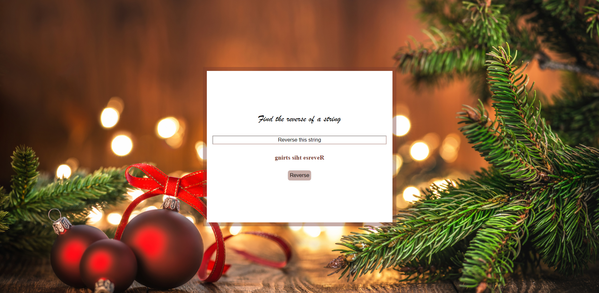

# 24 days of #JavaScriptmas

Level up JavaScript skills with a daily coding challenge from December 1st to 24th.

Challenge available [HERE](https://scrimba.com/learn/adventcalendar)

1. Candies<br>
   Determine how many pieces of candy will be eaten by all te children together

Solution:

```javascript
function candies(children, candy) {
  return Math.floor(candy / children) * children;
}
```


<br><br>

2. Deposit Profit<br>
   Find out how long it would take for your balance to pass a specific treshold with the assumption that you don't make any additional deposit

Solution:

```javascript
function depositProfit(deposit, rate, threshold) {
  let sum = deposit;
  let years = 0;

  while (sum < threshold) {
    sum = sum + (sum * 20) / 100;
    years++;
  }
  return years;
}
```


<br><br>

3. Chunky Monkey<br>
   Write a function that splits an array into groups the same length of size and returns them as a two-dimensional array

Solution:

```javascript
function chunkyMonkey(values, size) {
  return [[...values.slice(0, size)], [...values.slice(size, values.length)]];
}
```


<br><br>

4. Century from year<br>
   Given a year, return a century it is in.

Solution:

```javascript
function centuryFromYear(num) {
  return Math.ceil(num / 100);
}
```


<br><br>

5. Reverse a string<br>
   Reverse the provided string.

Solution:

```javascript
function reverseAString(str) {
  return str.split("").reverse().join("");
}
```


<br><br>

6. Sort by length<br>
   Given an array of strings, sort them in the order of increasing lengths.

Solution:

```javascript
function sortByLength(strs) {
  return strs.sort((a, b) => a.length - b.length);
}
```


<br><br>

7. Count vowel consonant<br>
   Return the sum of all letters in the input string.

Solution:

```javascript
function countVowelConsonant(str) {
  const vowels = ["a", "e", "i", "o", "u"];
  const chars = str.split("");
  return (total = chars.reduce((acc, char) => {
    if (vowels.includes(char)) {
      return acc + 1;
    }
    return acc + 2;
  }, 0));
}
```


<br><br>

8. Rolling dice<br>
   In this challenge a casino has asked you to make an online dice that works just like it would in real life. Using the pre-made dice face that represents ‘one’, make the faces for ‘two’, ‘three’, ‘four’, ‘five’ and ‘six’. Now when the users clicks the dice on the screen the dice is expected to show one of the faces randomly.

Solution:

```javascript
const dice = document.querySelector(".dice");
const dots = document.querySelector(".dots");
const dotsClasses = ["dot", "dot2", "dot3", "dot4", "dot5", "dot6"];
let lastDots = "dot";

function rollDice() {
  dots.classList.remove(lastDots);
  const randomClass = dotsClasses[Math.floor(Math.random() * 5)];
  if (randomClass === lastDots) return;

  lastDots = randomClass;
  dots.classList.add(randomClass);
}

dice.addEventListener("click", rollDice);
```


<br><br>

9. Sum Odd Fibonacci Numbers<br>
   Given a positive integer num, return the sum of all odd Fibonacci numbers that are less than or equal to num.

Solution:

```javascript
function sumOddFibonacciNumbers(num) {
  let sum = 0;
  let previous = 0;
  let current = 1;
  while (current <= num) {
    if (current % 2 === 1) {
      sum += current;
    }
    const nextCurrent = cu;
  }
  return sum;
}
```


<br><br>

10. Adjacent Elements Product<br>
    Given an array of integers, find the pair of adjacent moments that has the largest product and return that product.

Solution:

```javascript
function adjacentElementsProduct(nums) {
  let largestProduct = nums[0] * nums[1];
  for (let i = 1; i < nums.length - 1; i++) {
    const adjacentProduct = nums[i] * nums[i + 1];

    if (largestProduct < adjacentProduct) {
      largestProduct = adjacentProduct;
    }
  }
  return largestProduct;
}
```


<br><br>

11. Avoid Obstacles<br>
    Find the minimal length of the jump enough to avoid all the obstacles.

Solution:

```javascript
function avoidObstacles(nums) {
  const largestNum = nums.sort((a, b) => a - b)[nums.length - 1];
  for (let i = 1; i <= largestNum + 1; i++) {
    if (nums.every((value) => value % i !== 0)) {
      return i;
    }
  }
}
```


<br><br>

12. Valid Time<br>
    Check if the given string is correct time representation of the 24-hour clock.

Solution:

```javascript
function validTime(str) {
  const [hours, minutes] = str.split(":");
  if (parseInt(hours) > 23 || parseInt(hours) < 0) {
    return false;
  }
  if (parseInt(minutes) > 59 || parseInt(minutes) < 0) {
    return false;
  }
  return true;
}
```


<br><br>

13. Extract Each Kht<br>
    Given array of integers, remove each kth element from it.

Solution:

```javascript
function extractEachKth(nums, index) {
  return nums.filter((value, i) => (i + 1) % index !== 0);
}
```


<br><br>

14. Maximal Adjacent Difference<br>
    Given an array of integers, find the maximal absolute difference between any two of it's adjacent elements.

Solution:

```javascript
function arrayMaximalAdjacentDifference(nums) {
  let maxDifference = 0;
  for (let i = 0; i < nums.length - 1; i++) {
    const absoluteDifference = Math.abs(nums[i] - nums[i + 1]);
    if (maxDifference < absoluteDifference) {
      maxDifference = absoluteDifference;
    }
  }
  return maxDifference;
}
```


<br><br>

15. JavaScript Carousel<br>
    Use JS to make it function. Left & right arrrows should work. Bonus: Use CSS transitions.

Solution:

```javascript
const gallery = document.getElementsByClassName("gallery")[0];
const prevBtn = document.getElementsByClassName("previous")[0];
const nextBtn = document.getElementsByClassName("next")[0];
const galleryCardCount = document.getElementsByClassName("card").length;

let currentGalleryXOffset = 0;
const endGalleryXOffset = (galleryCardCount - 1) * -220;

prevBtn.addEventListener("click", galleryClickHandler);
nextBtn.addEventListener("click", galleryClickHandler);

function galleryClickHandler(event) {
  let targetBtn = event.target.className;
  if (targetBtn == "previous" && currentGalleryXOffset < 0) {
    currentGalleryXOffset += 220;
  } else if (targetBtn == "next" && currentGalleryXOffset > endGalleryXOffset) {
    currentGalleryXOffset -= 220;
  }

  if (currentGalleryXOffset == 0) {
    prevBtn.style.opacity = 0.3;
    prevBtn.style.cursor = "default";
  } else {
    prevBtn.style.opacity = 1; //disabled
    prevBtn.style.cursor = "pointer";
  }

  if (currentGalleryXOffset == endGalleryXOffset) {
    nextBtn.style.opacity = 0.3;
    nextBtn.style.cursor = "default";
  } else {
    nextBtn.style.opacity = 1;
    nextBtn.style.cursor = "pointer";
  }

  gallery.style.transform = `translateX(${currentGalleryXOffset}px)`;
}
```


<br><br>

16. Insert Dashes<br>
    Transform a given sentence into a new one with dashes between each two consecutive letters.

Solution:

```javascript
function insertDashes(str) {
  const words = str.split(" ");
  const dashedWords = words.map((word) => {
    const chars = word.split("");

    return chars.join("-");
  });
  return dashedWords.join(" ");
}
```


<br><br>

17. Different symbols naive<br>
    Given a string, find the number of different characters in it.

Solution:

```javascript
function differentSymbolsNaive(str) {
  const chars = str.split("");
  return new Set(chars).size;
}
```


<br><br>

18. Array previous less<br>
    Given an array of integers, for each position i, search among the previous positions for the las position that contains a smaller value.

Solution:

```javascript
function arrayPreviousLess(nums) {
  const previousLess = [];
  for (let i = nums.length - 1; i >= 0; i--) {
    for (let j = i; j >= 0; j--) {
      if (nums[i] > nums[j]) {
        previousLess.unshift(nums[j]);
        break;
      } else if (j === 0) {
        previousLess.unshift(-1);
      }
    }
  }
  return previousLess;
}
```


<br><br>

19. Alphabet Subsequence<br>
    Check whether the given string is a subsequence of the plaintext alphabet

Solution:

```javascript
function arrayPreviousLess(nums) {
  const previousLess = [];
  for (let i = nums.length - 1; i >= 0; i--) {
    for (let j = i; j >= 0; j--) {
      if (nums[i] > nums[j]) {
        previousLess.unshift(nums[j]);
        break;
      } else if (j === 0) {
        previousLess.unshift(-1);
      }
    }
  }
  return previousLess;
}
```


<br><br>

20. Domain Type<br>
    You want to write a function that labels the domains as "commercial", "network" or "information" for .com, .org, .net or .info respectively. For the given list of the domains return the list of their labels.

Solution:

```javascript
function domainType(domains) {
  const domainTypes = [];
  for (let i = 0; i < domains.length; i++) {
    const urlPieces = domains[i].split(".");
    const domain = urlPieces[urlPieces.length - 1];
    if (domain === "org") {
      domainTypes.push("organization");
    } else if (domain === "com") {
      domainTypes.push("commercial");
    } else if (domain === "net") {
      domainTypes.push("network");
    } else if (domain === "info") {
      domainTypes.push("information");
    }
  }
  return domainTypes;
}
```


<br><br>

21. Sum of 2<br>
    You have two integer arrays, a and b, and an integer target value v. Determine whether there is a pair of numbers, where one numer is taken from a and the other from b, that can be added together to get a sum of v. Return true if such a pair exists, otherwise return false.

Solution:

```javascript
function sumOfTwo(nums1, nums2, value) {
  const longerArray = nums1.length > nums2.length ? nums1 : nums2;
  const shorterArray = nums1.length > nums2.length ? nums2 : nums1;
  let isSum = 0;
  longerArray.forEach((item) => {
    shorterArray.forEach((item2) => {
      if (item + item2 === value) isSum = isSum + 1;
    });
  });
  return isSum != 0;
}
```


<br><br>

22. Extract Matrix Column<br>
    Given a rectangular matrix and an integer column, return ana ray containing the elements of the columnth column of the given matrix.

Solution:

```javascript
function extractMatrixColumn(matrix, column) {
  return matrix.map((row) => row[column]);
}
```


<br><br>

23. Social media input challenge<br>
    Use JS to count characters. Dynamically show he characters used/remaining. Disable the Tweet button if maximum character limit is exceeded.

Solution:

```javascript
let textArea = document.getElementById("string");
const button = document.querySelector("#btn");
function addDisableClass() {
  button.classList.add("buttonDisabled");
}
function removeDisableClass() {
  button.classList.remove("buttonDisabled");
}
function showText() {
  let counterDisplay = document.getElementById("counterFooter");
  let numberChars = textArea.value.length - 1;
  counterDisplay.innerHTML = `${140 - numberChars}/140`;
  if (numberChars > 140) {
    button.disabled = true;
    addDisableClass();
    counterDisplay.style.color = "red";
  } else if (numberChars >= 120 && numberChars <= 140) {
    counterDisplay.style.color = "red";
  } else {
    button.disabled = false;
    removeDisableClass();
    counterDisplay.style.color = "white";
  }
}
textArea.addEventListener("keydown", function (event) {
  showText();
});
```


<br><br>

24. Test Your Agility<br>
    Use sleep() function. Show the player the numbers with .innerHTML. Don't forget, var pushed is defined globally and changes to true after the STOP button is pushed.

Solution:

```javascript
var pushed = false;
var targetInt;
var spinningElem = document.getElementById("spinning");
document
  .getElementById("buttonPressed")
  .addEventListener("click", buttonPressed);
function buttonPressed() {
  pushed = true;
}
function setTargetInt() {
  var targetElem = document.getElementById("targetNum");
  targetInt = Math.floor(Math.random() * 101);
  targetElem.innerHTML = targetInt;
}
const sleep = (milliseconds) => {
  return new Promise((resolve) => setTimeout(resolve, milliseconds));
};
const spin = async () => {
  let i = 0;
  while (i < 100 && !pushed) {
    await sleep(250);
    ++i;
    spinningElem.innerHTML = i;
  }
  stop(i);
};
function stop(i) {
  var result = document.getElementById("result");
  if (i !== targetInt) {
    result.innerHTML = `Oh no! you lose off by  ${Math.abs(targetInt - i)}`;
  } else {
    result.innerHTML = `DANG DANG DANG YOU GOT IT CHAMP`;
  }
}
setTargetInt();
spin();
```


<br><br>
